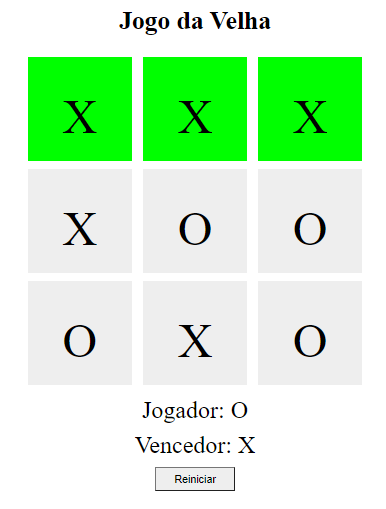

# **Criando seu próprio jogo da velha com HTML e Javascript**

## Projeto do Bootcamp JavaScript Game Developer na plataforma [Digital Innovation One](https://digitalinnovation.one/sign-up)

### Ministrado por: [Vitor Ruschoni](https://www.linkedin.com/in/ruschoni02/)  

### **Objetivo**  

Criar o jogo da velha, utilizando somente HTML5 para estruturar nosso site, CSS3 para estilizar e dar vida a ele, e JavaScript para criarmos toda suas interações, desde a escolha do jogador, efetivar uma jogada e dar um vencedor ao jogo.

  

### **Conceitos Abordados**
- Conceitos básicos sobre as linguagens HTML5, CSS3 e JavaScript.
- Funções básicas e lógica.
  
### **Tecnologias Utilizadas**
- Visual Studio Code:
    - Live Server.
- Navegador.

### **Resultado Final**

